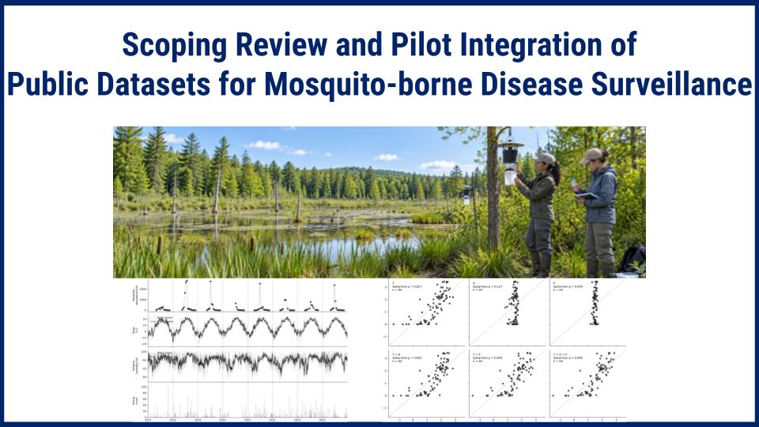

<!--
## Scoping and Integrating Public Datasets for Mosquito-Borne Disease Surveillance
-->

  

## Short Project Summary

Mosquito-borne disease surveillance requires integrating diverse information on mosquito activity, environmental conditions, habitat, and potential hosts. However, public datasets differ substantially in coverage, resolution, collection methods, and data quality. This paper conducted a PRISMA-ScR-aligned scoping review of publicly available quantitative data sources and a pilot integration of selected datasets. Searches of Google Dataset Search, Data.gov, and UNICEF Data Warehouse yielded 578 records, from which seven data sources were retained and reviewed. These sources cover mosquito activity and pathogens, meteorological conditions, terrestrial and habitat characteristics, and bird ecology. By integrating mosquito abundance, temperature and humidity, and precipitation data from the National Ecological Observatory Network, a pilot analysis visualized seasonal and year-to-year temporal patterns and examined preliminary relationships between mosquito abundance and environmental conditions. The results demonstrate both the potential of public datasets for integrated mosquito surveillance and the practical challenges involved in data integration. 

## Project Summary

Mosquitoes are more than a nuisance. They can transmit serious diseases such as West Nile virus (WNV), eastern equine encephalitis (EEE), malaria, dengue, Zika, and chikungunya. In the United States, WNV is the leading cause of mosquito-borne disease in the contiguous states and has caused more than 31,800 neurologic illness cases and 2,900 deaths from 1999 to 2024 (CDC, 2025a). In Massachusetts, WNV and EEE are especially important public health concerns. Since 2000, there have been 275 WNV cases among Massachusetts residents, including at least 17 deaths, and 47 EEE cases, including at least 23 deaths. EEE virus is endemic in Massachusetts and naturally found in some passerine bird species living in and around freshwater swamp habitats (MA DPH, 2026a). Currently, no licensed vaccines or specific antiviral treatments are available for WNV or EEE (CDC, 2025b, 2026). As a result, prevention depends on mosquito-bite avoidance, mosquito control, and proactive surveillance.

Effective mosquito-borne disease surveillance requires combining different types of information—not only mosquito activity, but also meteorological conditions such as temperature, humidity, and precipitation; terrestrial and habitat characteristics such as vegetation and surface water; and ecological factors such as bird abundance and species composition. Using a scoping review approach aligned with the PRISMA Extension for Scoping Reviews (PRISMA-ScR; Tricco et al., 2018), this work systematically identifies and characterizes relevant public data sources and examines how quantitative datasets from these sources can support mosquito-borne disease surveillance.

This work evaluates the identified data sources in terms of their variables and measurement types, collection methods, accessibility, geographic and temporal coverage, spatial and temporal resolution, update frequency, data quality, and potential sources of bias and uncertainty. To evaluate the feasibility of dataset integration, a pilot analysis is conducted using selected mosquito and meteorological datasets. The pilot examines how these datasets can be processed and aligned to account for differences in measurement type, temporal coverage, temporal resolution, and data quality, and assesses whether the integrated data reveal plausible relationships between mosquito activity and  meteorological conditions. These analyses are intended to identify practical challenges and limitations in integrating public datasets and to provide a foundation for larger-scale data integration and mosquito-borne disease risk modeling.

## Datasets
-  [National Ecological Observatory Network (NEON)](https://data.neonscience.org/)
    - Mosquitoes sampled from CO2 traps ([DP1.10043.001](https://data.neonscience.org/data-products/DP1.10043.001/))
    - Temperature and relative humidity ([DP1.00098.001](https://data.neonscience.org/data-products/DP1.00098.001))
    - Precipitation - weighing gauge ([DP1.00044.001](https://data.neonscience.org/data-products/DP1.00044.001))
    - 2D windspeed (DP1.00001.001)
    - Vegetation indices (DP3.30026.001)
- [Massachusetts Department of Public Heath](https://www.mass.gov/mosquito-borne-diseases)
    - [WNV/EEE-positive mosquito data](https://www.mass.gov/lists/arbovirus-surveillance-plan-and-historical-data)
- [Google Earth Engine](https://earthengine.google.com/)
    - NLCD land cover and imperviousness
    - MODIS Vegetation indices
    - Sentinel-1 SAR
- [NASA POWER](https://power.larc.nasa.gov/)
    - Temperature (T2M)
    - Daily mininum and maximum temp (T2M_MIN, T2M_MAX)
    - Relative humidity (RH2M)
    - Specific humidify (QV2M)
    - Wind speed (WS2M)
    - Precipitation corrected (PRECTOTCORR)
    - Surface soil moisture (SFMC)
    - Evaporation land (EVLAND)
    

## Presentations

<!--
- [Scoping and Integrating Public Datasets for Mosquito-Borne Disease Surveillance](https://github.com/HSSBoston/mosquitos), Excellence in Research Award, AnimalHack 2026, September 2026. 
-->

